# Application a la segmentation d'image par HMC et parcours de Peano

## Principe

Le principe de cette partie est de transformer une image 2D en un signal 1D au moyen du parcours de Peano, afin de conserver autant que possible les relations de voisinage entre pixels. Si l'image contient $N$ pixels, on obtient ainsi une suite d'observations $y = (y_1, \dots, y_N)$.

Cette suite est modelisee par une chaine de Markov cachee a $K = 2$ classes. On note $x_n \in \{1,2\}$ la classe cachee du pixel $n$. Le modele est defini par :

- une loi initiale $ \pi_i = P(x_1 = i)$ ;
- une matrice de transition $A = (a_{ij})$ avec $a_{ij} = P(x_n = j \mid x_{n-1} = i)$ ;
- des emissions gaussiennes $y_n \mid x_n = i \sim \mathcal{N}(\mu_i, \sigma_i^2)$.

La densite jointe s'ecrit alors

$$
p(x,y) = p(x_1)\,p(y_1 \mid x_1)\prod_{n=2}^N p(x_n \mid x_{n-1})\,p(y_n \mid x_n).
$$

Les parametres

$$
\theta = (\pi, A, \mu_1, \mu_2, \sigma_1^2, \sigma_2^2)
$$

sont appris de maniere non supervisee par l'algorithme EM, qui maximise la vraisemblance $p(y \mid \theta)$. A l'etape E, on calcule les probabilites a posteriori

$$
\gamma_n(i) = P(x_n = i \mid y)
\qquad \text{et} \qquad
\xi_n(i,j) = P(x_{n-1}=i, x_n=j \mid y).
$$

A l'etape M, on met a jour par exemple

$$
\mu_i = \frac{\sum_n \gamma_n(i)\,y_n}{\sum_n \gamma_n(i)},
\qquad
\sigma_i^2 = \frac{\sum_n \gamma_n(i)\,(y_n-\mu_i)^2}{\sum_n \gamma_n(i)},
$$

$$
a_{ij} = \frac{\sum_{n=2}^N \xi_n(i,j)}{\sum_{n=2}^N \gamma_{n-1}(i)}.
$$

Une fois ces parametres estimes, la segmentation est obtenue par une decision bayesienne de type MPM, c'est-a-dire

$$
\hat{x}_n = \arg\max_i P(x_n = i \mid y).
$$

Le vecteur segmente est enfin reconstruit sous forme d'image par le parcours de Peano inverse.

## Resultats sur trois formes simples

### Cas 1. Cible concentrique

Image source :

Image segmentee :

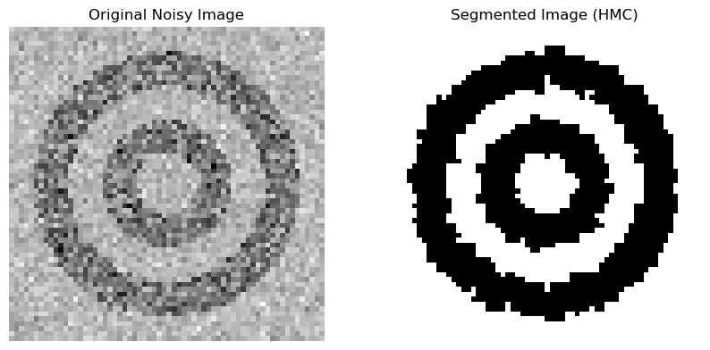

Courbes de convergence :

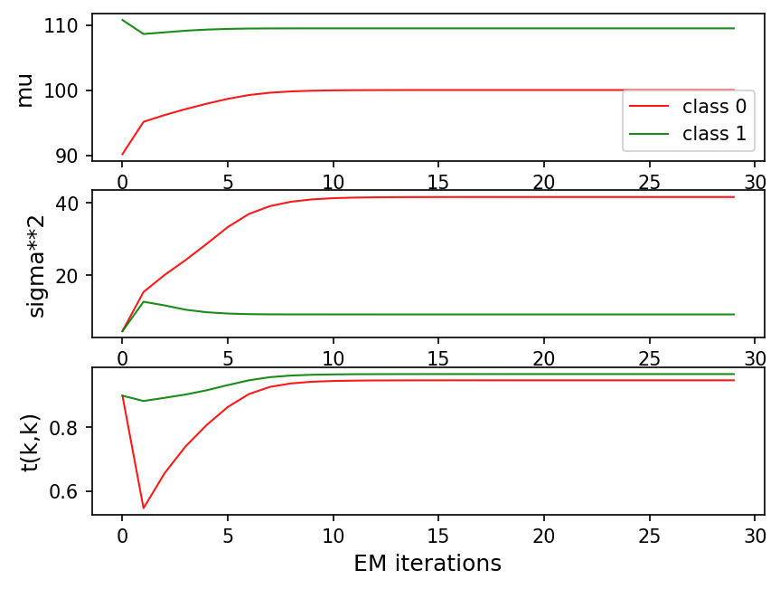

Histogramme et melange gaussien estime :

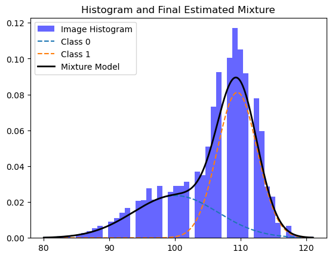

Commentaire :

La structure concentrique de la cible est bien retrouvee apres segmentation. Les anneaux restent visibles et la regularisation markovienne limite les erreurs isolees dues au bruit. Les courbes montrent une convergence progressive vers des moyennes proches de $100$ et $110$, des variances d'environ $41$ et $9$, et des probabilites diagonales proches de $0.95$.

Autrement dit, la matrice de transition estimee est proche de

$$
A \approx
\begin{pmatrix}
0.95 & 0.05 \\
0.05 & 0.95
\end{pmatrix},
$$

ce qui signifie qu'un changement de classe ne survient qu'avec une probabilite d'environ $5\,\%$ entre deux positions consecutives du parcours. Ce terme de persistance explique la disparition d'une grande partie du bruit impulsionnel tout en preservant les anneaux. Ce cas est le plus interessant pour montrer l'effet du parcours de Peano sur une geometrie non triviale.

### Cas 2. Disque central

Image source :

Image segmentee :

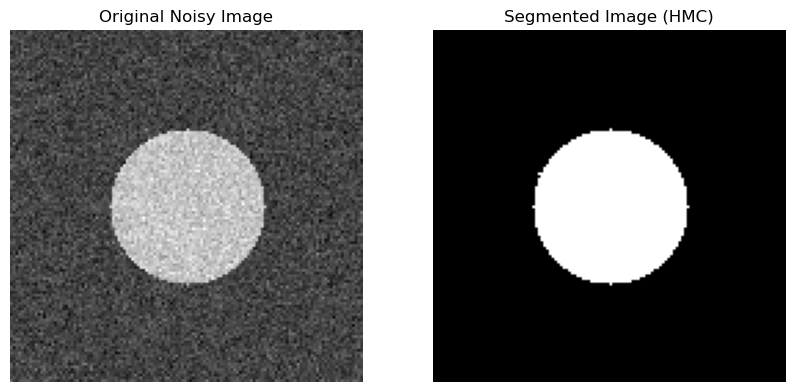

Courbes de convergence :

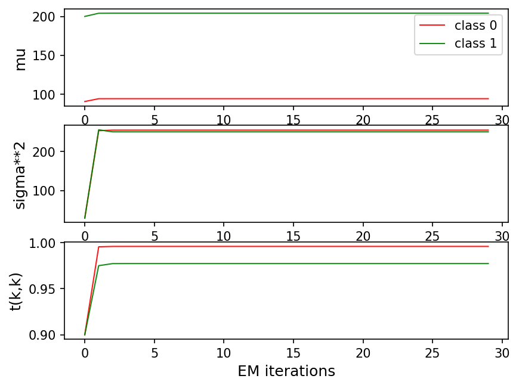

Histogramme et melange gaussien estime :

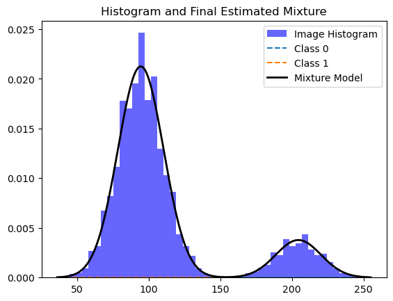

Commentaire :

Ce cas est le plus favorable. Les deux classes sont nettement separees en intensite et la forme centrale est compacte. La segmentation obtenue est tres propre, avec un contour bien conserve. Les courbes se stabilisent presque immediatement, avec des moyennes proches de $94$ et $204$, des variances de l'ordre de $250$, et des probabilites de transition diagonales tres elevees, proches de $1$.

On peut l'interpreter par un bon rapport signal/bruit entre les deux classes :

$$
\Delta_\mu = |204 - 94| = 110
$$

alors que l'ecart-type est de l'ordre de $\sqrt{250} \approx 15.8$. La distance entre les moyennes vaut donc environ $110 / 15.8 \approx 7$ ecarts-types, ce qui rend le recouvrement des deux gaussiennes tres faible. Dans ce contexte, le modele markovien sert surtout a regulariser legerement les contours.

### Cas 3. Carre central

La figure suivante montre a gauche l'image bruitee et a droite l'image segmentee.

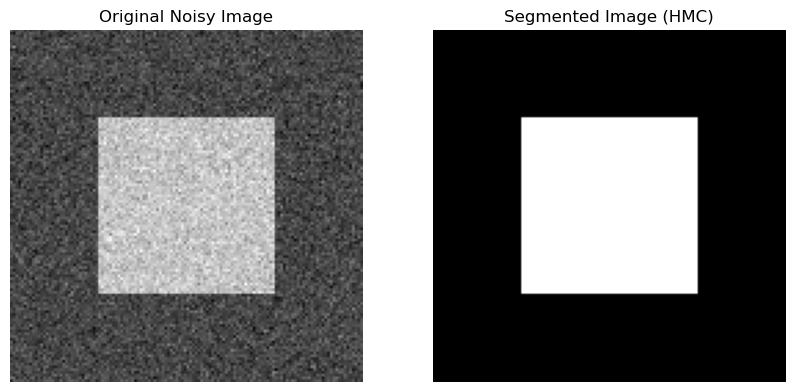

Courbes de convergence :

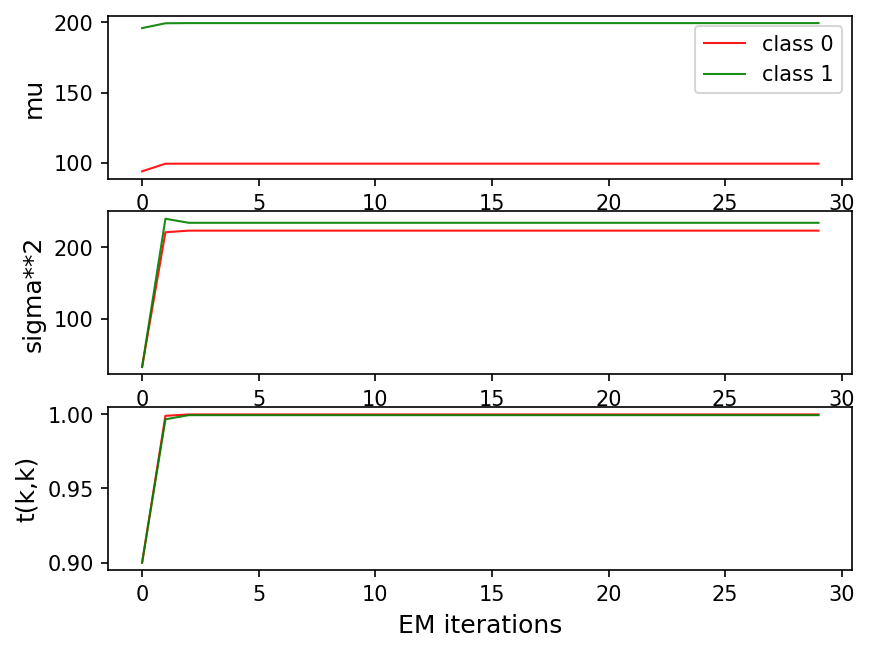

Histogramme et melange gaussien estime :

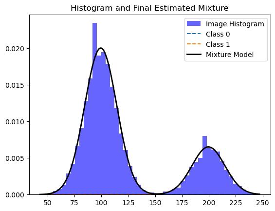

Commentaire :

La zone carree centrale est bien detectee et les contours sont nets. L'histogramme presente deux modes bien separes, ce qui facilite l'estimation des deux classes gaussiennes. Les courbes de convergence indiquent une stabilisation tres rapide des parametres, avec des moyennes proches de $100$ et $200$ et des probabilites diagonales pratiquement egales a $1$.

Ici, le modele est dans une configuration presque deterministe : si $a_{11} \approx a_{22} \approx 1$, alors la penalisation des ruptures est maximale et seules quelques transitions restent localisees sur le contour du carre. Comme la longueur du contour est faible devant l'aire des regions homogenes, le nombre de changements d'etat a estimer le long du parcours de Peano reste limite. Ce cas confirme que la methode est tres efficace lorsque les regions sont grandes et homogenes.

## Comparaison avec des methodes non spatiales

Afin d'evaluer l'apport de la regularisation spatiale, la methode HMC + Peano a ete comparee a deux approches ne prenant en compte que l'intensite des pixels : le seuillage d'Otsu et le clustering K-Means a $K = 2$.

Comparaison visuelle :

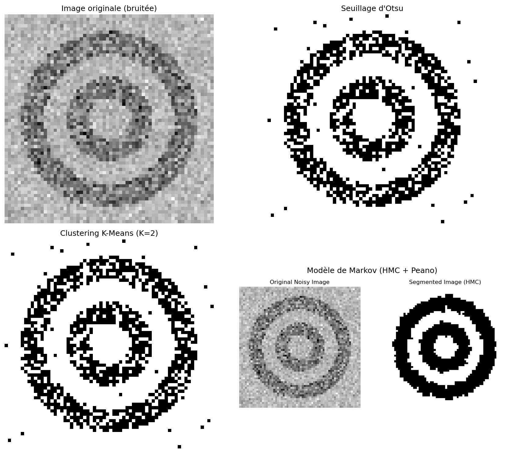

Sur la cible concentrique, Otsu et K-Means retrouvent la structure globale, mais laissent apparaitre de nombreux pixels errones dans les anneaux et dans le fond. La segmentation HMC est beaucoup plus reguliere et produit des zones quasi continues.

Comparaison quantitative :

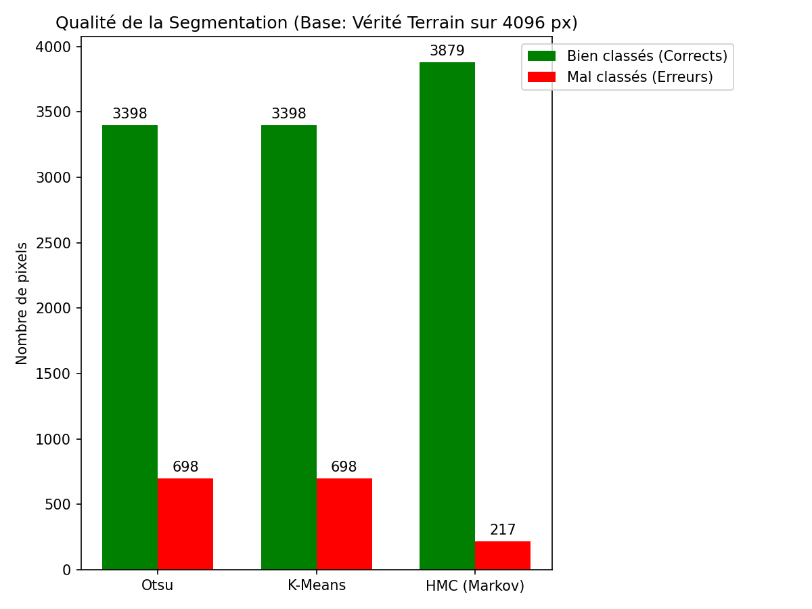

Le graphe montre, sur $4096$ pixels, les resultats suivants :

- Otsu : $3398$ pixels bien classes et $698$ erreurs, soit $82.96\,\%$ de bonne classification.
- K-Means : $3398$ pixels bien classes et $698$ erreurs, soit $82.96\,\%$ de bonne classification.
- HMC + Peano : $3879$ pixels bien classes et $217$ erreurs, soit $94.70\,\%$ de bonne classification.

La methode HMC apporte donc un gain de $481$ pixels correctement classes par rapport a Otsu et a K-Means, soit un gain absolu de $11.74$ points de precision ($94.70 - 82.96$). En termes d'erreur, on passe de $698$ a $217$ pixels mal classes, soit une reduction relative de

$$
\frac{698 - 217}{698} \approx 68.9\,\%.
$$

Cette amelioration confirme l'interet de la modelisation markovienne : contrairement a Otsu ou K-Means, la decision en un pixel ne depend pas seulement de $y_n$, mais aussi indirectement du contexte via les termes $P(x_n \mid x_{n-1})$ et $P(x_{n+1} \mid x_n)$. Un pixel ambigu isole a donc peu de chance d'inverser la classe si ses voisins le long du parcours appartiennent majoritairement a l'autre region.

Il faut toutefois noter que cette evaluation repose sur une verite terrain approchee, obtenue a partir d'un lissage fort suivi d'un seuillage, et non sur une annotation manuelle. Les chiffres restent donc indicatifs, meme s'ils confirment clairement la superiorite du modele spatial sur cet exemple.

## Bilan

Cette experience montre qu'une image 2D peut etre segmentee de maniere pertinente en la ramenant a un signal 1D par parcours de Peano, puis en appliquant un modele de chaine de Markov cachee appris par EM. Mathematiquement, l'approche remplace un probleme de classification pixel a pixel par l'estimation d'une loi jointe $p(x,y)$ qui combine attache aux donnees (les gaussiennes) et regularisation (la matrice de transition). Les meilleurs resultats sont obtenus lorsque les classes sont bien separees et spatialement coherentes, mais la methode reste egalement efficace sur une structure plus complexe comme la cible concentrique.

L'interet principal de l'approche est d'introduire une regularisation spatiale simple sans passer par un modele markovien 2D complet. Sa limite est que la dependance spatiale reste seulement approchee, car le voisinage est represente le long d'un parcours 1D. Malgre cela, les resultats obtenus montrent que cette approximation est deja suffisante pour ameliorer nettement la segmentation par rapport a des methodes purement aspatiales.
